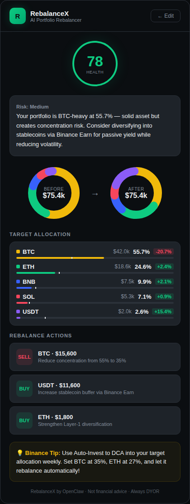

# RebalanceX — AI Portfolio Rebalancer for Binance

> Built with OpenClaw for the #AIBinance challenge

RebalanceX is an AI-powered portfolio rebalancing tool that helps Binance users optimize their asset allocation. Input your holdings, choose a risk profile, and get instant AI-driven rebalancing recommendations with actionable buy/sell steps.



## Features

- **Portfolio Health Score** — Instant 1-100 assessment of your allocation
- **Before/After Visualization** — Donut charts showing current vs. target allocation
- **Risk Profiles** — Conservative, Balanced, or Aggressive strategies
- **Rebalance Actions** — Specific BUY/SELL recommendations with USD amounts
- **Target Allocation Bars** — Visual comparison of current vs. optimal percentages
- **Binance Integration Tips** — Suggestions to use Auto-Invest, Earn, DCA features

## How It Works

1. Enter your crypto holdings (symbol + USD value)
2. Select a risk profile (Conservative / Balanced / Aggressive)
3. AI analyzes your portfolio and generates:
   - Health score and risk assessment
   - Optimal target allocation
   - Step-by-step rebalancing actions
   - Binance-specific tips for execution

## Quick Start

### Claude.ai Artifact (easiest)
Paste the contents of `rebalancex.jsx` into a new React artifact in Claude.ai. Works immediately.

### Standalone
Requires an Anthropic API key and a React environment:

1. Clone this repo
2. Set your API key: `export ANTHROPIC_API_KEY=your_key_here`
3. Integrate `rebalancex.jsx` into your React project
4. Add a backend proxy for secure API key handling

## Tech Stack

- React (hooks + functional components)
- Claude API (claude-sonnet-4-20250514) via OpenClaw
- SVG donut charts (no chart libraries)
- Binance-native dark theme (custom CSS)

## Project Structure

```
├── rebalancex.jsx   # Main React component (self-contained)
├── README.md        # This file
└── screenshot.png   # Demo screenshot
```

## License

MIT

---

Built for the [Binance x OpenClaw AI Challenge](https://www.binance.com/) #AIBinance
